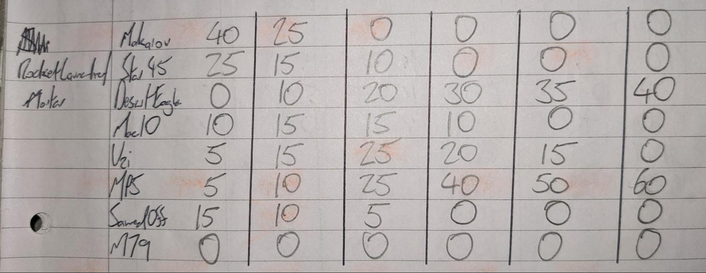

# Buddies

Each buddy has three entries in “xx_buddies.xml”: their version that will rescue you in the open world and you will meet during missions, their betrayed version encountered at the end of the game and their unarmed version found in the bars.

Their entry titles are:

| Buddy | Rescue/Mission version | Betrayed version | Unarmed version |
|---|---|---|---|
| Andre Hyppolite | Buddies.Andre_Hyppolite | Buddies.Andre_Hyppolite.Andre_Hyppolite_Betrayed | Buddies.Andre_Hyppolite_Unarmed |
| Flora Guillen | Buddies.Flora_Guillen | Buddies.Flora_Guillen.Flora_Guillen_Betrayed | Buddies.Flora_Guillen_Unarmed |
| Frank Bilders | Buddies.Frank_Bilders | Buddies.Frank_Bilders.Frank_Bilders_Betrayed | Buddies.Frank_Bilders_Unarmed |
| Hakim Echebbi | Buddies.Hakim_Echebbi | Buddies.Hakim_Echebbi.Hakim_Echebbi_Betrayed | Buddies.Hakim_Echebbi_Unarmed |
| Josip Idromeno | Buddies.Josip_Idromeno | Buddies.Josip_Idromeno.Josip_Idromeno_Betrayed | Buddies.Josip_Idromeno_Unarmed |
| Marty Alencar | Buddies.Marty_Alencar | Buddies.Marty_Alencar.Marty_Alencar_Betrayed | Buddies.Marty_Alencar_Unarmed |
| Michele Dachss | Buddies.Michele_Dachss | Buddies.Michele_Dachss.Michele_Dachss_Betrayed | Buddies.Michele_Dachss_Unarmed |
| Nasreen Davar | Buddies.Nasreen_Davar | Buddies.Nasreen_Davar.Nasreen_Davar_Betrayed | Buddies.Nasreen_Davar_Unarmed |
| Paul Ferenc | Buddies.Paul_Ferenc | Buddies.Paul_Ferenc.Paul_Ferenc_Betrayed | Buddies.Paul_Ferenc_Unarmed |
| Quarbani Singh | Buddies.Quarbani_Singh | Buddies.Quarbani_Singh.Quarbani_Singh_Betrayed | Buddies.Quarbani_Singh_Unarmed |
| Warren Clyde | Buddies.Warren_Clyde | Buddies.Warren_Clyde.Warren_Clyde_Betrayed | Buddies.Warren_Clyde_Unarmed |
| Xianyong Bai | Buddies.Xianyong_Bai | Buddies.Xianyong_Bai.Xianyong_Bai_Betrayed | Buddies.Xianyong_Bai_Unarmed |

## Buddy weapon packs

xx_buddies.xml \< entitylibrarypatchoverride.fcb (\patch_unpack\generated\\)

Buddies weapon packs are controlled by two stats, “8C965C28” and “packInventoryPack”.

There are two options for this:

8C965C28 - buddy

packInventoryPack - 1EA78759

8C965C28 - buddy_shotgun

packInventoryPack - 46F786B8

This is what weapon packs are by default assigned to each buddy:

Andre Hyppolite - buddy_shotgun

Flora Guillen - buddy

Frank Bilders - buddy_shotgun

Hakim Echebbi - buddy_shotgun

Josip Idromeno - buddy_shotgun

Marty Alencar - buddy

Michele Dachss - buddy

Nasreen Davar - buddy

Paul Ferenc - buddy_shotgun

Quarbani Singh - buddy

Warren Clyde - buddy_shotgun

Xianyong Bai - buddy

```xml {2-3}
<object type="Inventory">
       <value hash="8C965C28" type="String">buddy</value>
       <value name="packInventoryPack" type="Hash">1EA78759</value>
```

## Buddy weapons

gamemodesconfig.xml (\patch_unpack\engine\gamemodes\\)

Buddy weapons are controlled within the “\<InventoryPacks\>” section of this file.

There are different weapon packs here for the different buddy types, these are their titles:

```xml
<Pack name="buddy">
<Pack name="buddy_shotgun">
```

Below each of these titles you’ll see lists of weapons. Each buddy has two lists, one each to control their secondary and primary weapons. I have always kept the buddy secondary weapon as default, with only the desert eagle.

Each of these lists is made up of individual weapons and difficulty levels, these are the individual components:

SecondaryWeapon/PrimaryWeapon - These depend on the class of weapon you’re adding. “SecondaryWeapon” is for secondaries and “PrimaryWeapon” is for primaries. You can add special weapons under “PrimaryWeapon” and it will work fine.

difficulty=”xx” - There are 28 difficulty levels (0-27). I don’t know exactly how these apply to gameplay, whether it’s based on geography, infamy level or position in the story. I’ve done a test before by setting levels 26 and 27 to only flamethrowers, driving around the map everyone had regular weapons but once I went into the Heart of Darkness for the final stages of the game everyone had the flamethrowers. I’ve always imagined the transition from map 1 to map 2 happening around difficulty level 14.

probability=”xx” - You can set individual probabilities for each weapon within the difficulty levels. The probabilities for each difficulty level need to add up to 1. You can have as many weapons as you want with different probabilities or a single weapon with a probability of 1.

archetype=”xx” - This is the name for each weapon. You can find these names within the xx_weaponproperties.xml file from entitylibrarypatchoverride.fcb. Don’t forget that weapons that are specials for the player have separate versions for enemies that are primaries. These are normally marked by “\_Merc” in the title but for the flamethrower you can use the multiplayer version marked with “\_Multi” as that’s already a primary.

This is an example section from Vanilla+:

```xml
<PrimaryWeapon difficulty="24" probability="0.05" archetype="weapons.Primary.G3KA4" />
<PrimaryWeapon difficulty="24" probability="0.15" archetype="weapons.Primary.AK47" />
<PrimaryWeapon difficulty="24" probability="0.33" archetype="weapons.Primary.FNFAL" />
<PrimaryWeapon difficulty="24" probability="0.31" archetype="weapons.Primary.M16" />
<PrimaryWeapon difficulty="24" probability="0.05" archetype="weapons.Special.PKM.PKM_Merc" />
<PrimaryWeapon difficulty="24" probability="0.10" archetype="weapons.Special.M249_Saw.M249_Saw_Merc" />
<PrimaryWeapon difficulty="24" probability="0.01" archetype="weapons.Primary.AK47.AK47_Gold" />
```

Changing all of this is lots of work and if you make a single mistake in the format of a line your file can stop packing properly and you won’t know where you’ve gone wrong. I suggest planning it all out first. To make this easier I split the difficulties into sections (0-5, 6-10, 11-15, 16-20, 21-25, 26-27) and I made lists of it all in pencil so I could edit it and know what I want before working in the actual file.



## Health

**Decoding required**

xx_buddies.xml \< entitylibrarypatchoverride.fcb (\patch_unpack\generated\\)

Buddy health is controlled by the “fAgentHealth” stat in the “CFCXCountersComponentAIBuddy” section.

```xml {9}
<object type="CFCXCountersComponentAIBuddy">
      <value name="hidHasAliasName" type="Bool">False</value>
      <value name="archStimEffectTable" type="String">tables.StimEffectTables.NPCDefault</value>
      <value name="bIsInvincibleExceptToPlayer" hash="3DED5A88" type="Bool">False</value> <!-- type="BinHex" value="00" -->
      <value name="bIsInvincibleToAI" hash="C729E709" type="Bool">False</value> <!-- type="BinHex" value="00" -->
      <value name="bIsInvincibleToPlayer" hash="0E37A34A" type="Bool">False</value> <!-- type="BinHex" value="00" -->
      <value name="WeaponJamProbabilityScale" hash="2D6DDF89" type="Float">1.0</value> <!-- type="BinHex" value="0000803F" -->
      <value name="bEnableHitLocations" hash="F0A9E476" type="Bool">True</value> <!-- type="BinHex" value="01" -->
      <value name="fAgentHealth" hash="2B41D37D" type="Float">600.0</value> <!-- type="BinHex" value="00001644" -->
      <value name="fHealthFailureTorsoHitModifier" hash="00C9A8CA" type="Float">0.5</value> <!-- type="BinHex" value="0000003F" -->
      <value name="fHealthFailureLimbsHitModifier" hash="E7A28A51" type="Float">0.2</value> <!-- type="BinHex" value="CDCC4C3E" -->
      <value name="fHealthFailureCantDieDuration" hash="6A478A4A" type="Float">0.4</value> <!-- type="BinHex" value="CDCCCC3E" -->
</object>
```

## Invincibility

**Decoding required**

xx_buddies.xml \< entitylibrarypatchoverride.fcb (\patch_unpack\generated\\)

Buddy invincibility can be controlled using a number of stats in the “CFCXCountersComponentAIBuddy'' section. An important detail to remember with them is that explosions are classed as seperate to who caused them, meaning there are three basic sources of damage: enemies, the player, and explosions.

“bIsInvincibleExceptToPlayer” - Buddies are only vulnerable to player damage.

“bIsInvincibleToAI” - Buddies are vulnerable to player damage and explosions.

“bIsInvincibleToPlayer” - Buddies are vulnerable to enemy damage and explosions

You can set these values to either “True” or “False”.

```xml {4-6}
<object type="CFCXCountersComponentAIBuddy">
      <value name="hidHasAliasName" type="Bool">False</value>
      <value name="archStimEffectTable" type="String">tables.StimEffectTables.NPCDefault</value>
      <value name="bIsInvincibleExceptToPlayer" hash="3DED5A88" type="Bool">False</value> <!-- type="BinHex" value="00" -->
      <value name="bIsInvincibleToAI" hash="C729E709" type="Bool">False</value> <!-- type="BinHex" value="00" -->
      <value name="bIsInvincibleToPlayer" hash="0E37A34A" type="Bool">False</value> <!-- type="BinHex" value="00" -->
      <value name="WeaponJamProbabilityScale" hash="2D6DDF89" type="Float">1.0</value> <!-- type="BinHex" value="0000803F" -->
      <value name="bEnableHitLocations" hash="F0A9E476" type="Bool">True</value> <!-- type="BinHex" value="01" -->
      <value name="fAgentHealth" hash="2B41D37D" type="Float">600.0</value> <!-- type="BinHex" value="00001644" -->
      <value name="fHealthFailureTorsoHitModifier" hash="00C9A8CA" type="Float">0.5</value> <!-- type="BinHex" value="0000003F" -->
      <value name="fHealthFailureLimbsHitModifier" hash="E7A28A51" type="Float">0.2</value> <!-- type="BinHex" value="CDCC4C3E" -->
      <value name="fHealthFailureCantDieDuration" hash="6A478A4A" type="Float">0.4</value> <!-- type="BinHex" value="CDCCCC3E" -->
</object>
```
